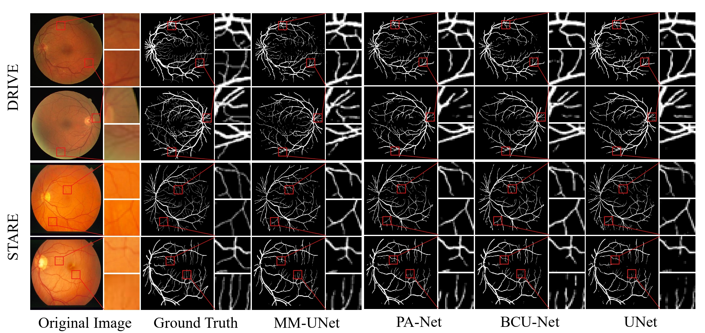
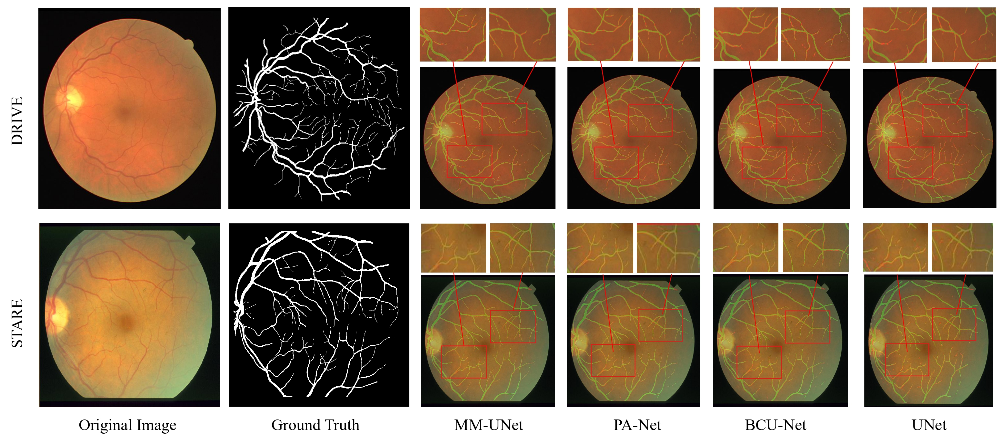

# MM-UNet: Morph Mamba U-shaped Convolutional Networks for Retinal Vessel Segmentation


### 🎉 This work is provisionally accepted by [BIBM 2025]([About BIBM-BIOD LAB,CS,WHU - 武汉大学医学人工智能实验室](https://biod.whu.edu.cn/bibm2025/))!


# How to run this code

All of the following operations must be entered in the operating system's command line. (Our fully code will be Coming soon)

## Get project

```
git clone git@https://github.com/liujiawen-jpg/MM-UNet
```

## Environment install

### It is recommended to use Python 3.10.x to avoid ImportError

```
cd requirements

# Necessary environment requirements
pip install -r requirements.txt

# Mamba base environment
cd /requirements/Mamba/causal-conv1d
python setup.py install
cd /requirements/Mamba/mamba
python setup.py install
# TFM method setting
# Find the mamba_sample.py file and replace it with requirements\mamba_sample.py
```

## Training

All of the following operations must be entered in the operating system's command line.

- Updating the parameters of config.yaml.

-  GPU training

```
python3 train.py
```

# Visual Comparisons 




## Notion

If there are any problems, please don't hesitate to contact us by email: [a2080463892@gmail.com]

## Acknowledgement

Many thanks for these repos for their great contribution!

https://github.com/Project-MONAI/MONAI

https://github.com/MIC-DKFZ/nnUNet

https://github.com/ge-xing/SegMamba

https://github.com/lhaof/nnMamba

https://github.com/LeonidAlekseev/Swin-UNETR

https://github.com/JeMing-creater/HWA-UNETR
